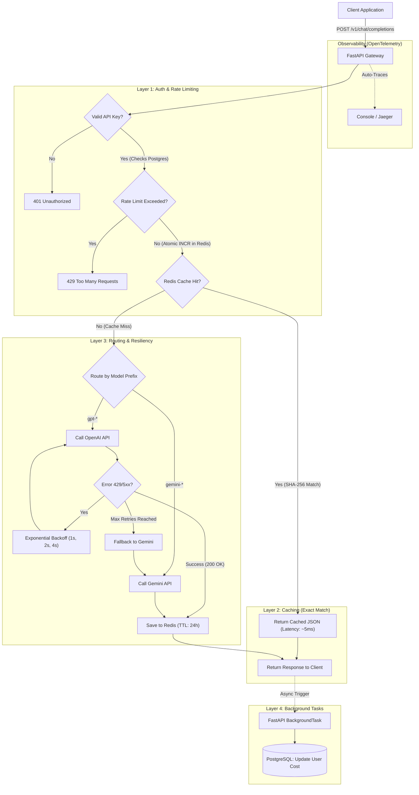

# 🏛️ LLM Gateway Architecture & Deep Dive Guide

Welcome to the **LLM Gateway** project! This document is built as a complete, beginner-friendly masterclass on the engineering concepts behind serving AI reliably at scale. It acts as both the architectural map of the repository and a textbook for anyone who wants to learn how to build high-concurrency Python applications.

As we progress through the phases of building this gateway, this document is updated to reflect every major engineering decision, algorithm, and concept we implement.

---

## 📖 Table of Contents
1. [System Flow Diagram](#%F0%9F%97%BA%EF%B8%8F-system-flow-diagram)
2. [The Problem: What is an LLM Gateway?](#1-the-problem-what-is-an-llm-gateway)
3. [Phase 1: Concurrency & Async Architecture](#2-phase-1-concurrency--async-architecture)
4. [Phase 2: Translation & Resiliency (Retries & Fallbacks)](#3-phase-2-translation--resiliency-retries--fallbacks)
5. [Phase 3: Real-Time Streaming (SSE & Generators)](#4-phase-3-real-time-streaming-sse--generators)
6. [Phase 4a: Database, Models, and Dependency Injection](#5-phase-4a-database-models-and-dependency-injection)
7. [Phase 4b: Distributed Rate Limiting (Redis Fixed Window)](#6-phase-4b-distributed-rate-limiting-redis-fixed-window)

---

## 🗺️ System Flow Diagram

Here is the complete visual blueprint of how a request flows through the gateway, from the initial API call to the final background cost tracking:



---

## 1. The Problem: What is an LLM Gateway?

When developers build AI applications, they typically hardcode API calls to providers like OpenAI, Anthropic, or Google Gemini. But this introduces massive single points of failure:
* **Uptime:** What if OpenAI goes down? Your app goes down.
* **Cost Spikes:** What if a user puts your app in an infinite loop? You get a massive API bill.
* **Vendor Lock-in:** What if Anthropic releases a better, cheaper model, but your entire codebase is hardcoded to use OpenAI's specific JSON format?

**The Solution:** An **LLM Gateway** is a reverse proxy. It sits securely between your application and the AI providers. Your application talks *only* to the Gateway. The Gateway handles the complex engineering: standardizing requests, routing traffic, retrying failures, falling back to backup models, and enforcing rate limits.

---

## 2. Phase 1: Concurrency & Async Architecture

### The Blocking Thread Problem
Large Language Models are inherently slow. It can take 5 to 10 seconds for an AI to generate a response. 
If we built our gateway using synchronous code (like the standard Python `requests` library), our server thread would physically halt and wait for those 10 seconds. 

If 100 users asked a question at the same time, the server would quickly run out of threads, memory, and ultimately crash under the weight of connection timeouts.

### The Async Solution (`httpx` + `FastAPI`)
We built the gateway using **FastAPI** and the `httpx.AsyncClient` (`app/services/openai_client.py`). By using Python's `async` and `await` keywords, we implemented a non-blocking architecture.

When our gateway sends a request to OpenAI, the code looks like this:
```python
async with httpx.AsyncClient() as client:
    response = await client.post(OPENAI_API_URL, json=payload)
```
The `await` keyword tells the Python event loop: *"I'm going to pause this specific request here. Go help other users while I wait for OpenAI to reply."* 
This allows a single Python server to handle thousands of concurrent requests without breaking a sweat.

---

## 3. Phase 2: Translation & Resiliency (Retries & Fallbacks)

### The Translation Layer (Pydantic Schemas)
Our gateway exposes a single endpoint: `POST /v1/chat/completions`. This perfectly mimics the official OpenAI API. To a client application, our gateway *looks* exactly like OpenAI.

But if a user requests a Gemini model (`model: "gemini-1.5-flash"`), we have a problem. Gemini uses a completely different JSON format than OpenAI.
* **OpenAI expects:** `{"messages": [{"role": "user", "content": "hello"}]}`
* **Gemini expects:** `{"contents": [{"role": "user", "parts": [{"text": "hello"}]}]}`

**How we solved it in `app/services/gemini_client.py`:**
1. **Pydantic Validation (`app/models/schemas.py`)**: We strictly validate incoming traffic to ensure it matches the standard OpenAI shape. Pydantic acts as our bouncer.
2. **Data Mapping**: We intercept the validated OpenAI array, loop through it, and dynamically map it to Gemini's `contents/parts/text` dictionary structure.
3. **Repackaging**: Once Gemini replies, we extract the text from its deeply nested JSON and repackage it into our standard `ChatCompletionResponse` schema.

### Exponential Backoff Algorithm
Network requests fail. AI providers get overloaded and return HTTP `429 Too Many Requests` or `500 Internal Server Error`. If they are overloaded, slamming them instantly with a retry makes the outage worse.

In `app/api/routes.py`, we implemented `execute_with_retry()` using **Exponential Backoff**:
```python
sleep_time = base_delay * (2 ** attempt)
await asyncio.sleep(sleep_time)
```
* **Attempt 1:** Fails. Gateway sleeps for 1 second.
* **Attempt 2:** Fails. Gateway sleeps for 2 seconds.
* **Attempt 3:** Fails. Gateway sleeps for 4 seconds.
This mathematical delay allows the downstream provider time to recover.

### Graceful Fallbacks
If OpenAI completely exhausts all retries and remains dead, our gateway initiates a "Fallback". It automatically catches the failure, logs a warning, and routes the exact same prompt to `gemini-1.5-flash`. To the end-user, the request took a few seconds longer, but it succeeded! The user never sees the OpenAI outage.

---

## 4. Phase 3: Real-Time Streaming (SSE & Generators)

### The Sync vs Streaming Experience
Waiting 10 seconds for a massive block of text to load is a terrible user experience. We want the text to stream onto the user's screen letter-by-letter as it generates.

### Server-Sent Events (SSE)
We implemented this using Server-Sent Events. Unlike WebSockets (which are two-way communication channels), SSE is a simple, one-way stream over a standard HTTP connection. Data is sent line-by-line, separated by a double newline (`\n\n`).

### Python Generators (`yield`)
In `app/services/openai_client.py`, we wrote the `stream_openai()` function:
```python
async with client.stream("POST", OPENAI_API_URL, headers=headers, json=payload) as response:
    async for line in response.aiter_lines():
        if line:
            yield f"{line}\n\n"
```
* **`client.stream()`**: This `httpx` context manager tells the client NOT to close the HTTP socket and NOT to wait for the full response.
* **`yield`**: Notice we do not `return`. By using `yield`, we turn our function into a Python **Generator**. Every time OpenAI emits a tiny chunk of text across the network, our generator catches it, adds the double newline, and spits it upward.

In `app/api/routes.py`, we pass this generator directly into FastAPI's `StreamingResponse`. FastAPI keeps the client's browser connection open and pipes the chunks directly to them in real-time.

---

## 5. Phase 4a: Database, Models, and Dependency Injection

To track costs and prevent abuse, we need to know *who* is making the request.

### Async SQLAlchemy
Just like API calls, database queries are network calls that block the server. In `app/db/database.py`, we use `SQLAlchemy 2.0` with the `asyncpg` driver to make our PostgreSQL connections fully asynchronous. We use `create_async_engine` and `async_sessionmaker` to generate isolated, non-blocking database sessions for every incoming web request.

### Models vs Schemas
It's crucial to understand the difference between our two data structures:
* **Schemas (`schemas.py`)**: Built with Pydantic. They validate the JSON payloads entering and leaving the API.
* **Models (`domain.py`)**: Built with SQLAlchemy. They map perfectly to the actual rows and columns inside our PostgreSQL tables (`users` and `api_keys`).

### Dependency Injection (`get_current_user`)
In `app/api/dependencies.py`, we wrote a function that extracts the `Authorization: Bearer <token>` header, queries the database, and returns the User.

FastAPI's superpower is Dependency Injection. In our route:
```python
async def chat_completions(request: ChatCompletionRequest, user: User = Depends(get_current_user)):
```
Before the route code even executes, FastAPI pauses, runs `get_current_user`, and injects the fully authenticated `User` object directly into our function parameters. If the API key is fake, it throws a `401 Unauthorized` before our LLM code ever runs.

---

## 6. Phase 4b: Distributed Rate Limiting (Redis Fixed Window)

If a user writes a bad script containing an infinite loop, they could send 10,000 requests to our gateway, resulting in an astronomical OpenAI bill. We must rate limit them.

### Why Redis?
If we stored the rate limit counter in local Python memory, and our gateway scaled horizontally across 5 Docker containers, a user could bypass the limit by hitting different containers. **Redis** is an external, ultra-fast, in-memory cache. All 5 containers talk to the same Redis instance, ensuring the limit is strictly enforced globally.

### The Fixed Window Algorithm
In `app/services/rate_limiter.py`, we implemented the Fixed Window algorithm. Here is the math and logic behind it:

1. **Calculate the Window:**
   ```python
   window_key = int(time.time()) // 60
   ```
   We divide the current Unix timestamp by 60 (seconds). This truncates the timestamp, meaning all requests that occur within the same minute will generate the exact same `window_key`.

2. **The Redis Key:**
   ```python
   redis_key = f"rate_limit:user:{user_id}:window:{window_key}"
   ```
   We create a string unique to the User AND the specific minute.

3. **Atomic INCR:**
   ```python
   request_count = await redis_client.incr(redis_key)
   ```
   We ask Redis to increment the value at that key. `INCR` is an **Atomic Operation**. This means that even if 100 requests arrive at the exact same millisecond, Redis guarantees the count will be mathematically perfect. There are no race conditions.

4. **Preventing Memory Leaks (TTL):**
   ```python
   if request_count == 1:
       await redis_client.expire(redis_key, 120)
   ```
   If we generated thousands of keys every minute forever, Redis would run out of RAM and crash. If it's the very first request of the minute, we set a Time-To-Live (TTL). After 120 seconds, Redis automatically deletes the key, keeping our memory footprint tiny.

---

## 7. Phase 4c: Background Tasks & Cost Tracking

Our gateway rate-limits users, but it also needs to track exactly how many tokens they consume so we can bill them.
When a successful response is returned from OpenAI, it includes a `usage` dictionary (`prompt_tokens` and `completion_tokens`).

### The Database Bottleneck
If we pause our API route, calculate the cost, open a PostgreSQL transaction, and update the user's `total_cost`, we are adding perhaps 50–100ms of latency to the user's request. Over millions of requests, this database overhead degrades the API's performance.

### FastAPI Background Tasks
We solved this using FastAPI's built-in `BackgroundTasks`. 
In `app/api/routes.py`:
```python
background_tasks.add_task(
    track_cost_background_task,
    user_id=user.id,
    model=response.model,
    prompt_tokens=response.usage.prompt_tokens,
    completion_tokens=response.usage.completion_tokens
)
return response
```
FastAPI immediately returns the `response` to the user. The HTTP connection closes, and the user gets their data instantly. *Then*, FastAPI takes the `track_cost_background_task` function and runs it in the background on the server.

Inside `app/services/cost_tracker.py`, we multiply the tokens by our pricing table, open a *new* async database session, and perform an atomic `UPDATE` on the `users` table. This allows us to track every fraction of a cent without slowing down the core API layer!

---

## 8. Phase 5: Redis Exact-Match Caching

If 100 users ask the Gateway *"What is the capital of France?"*, we would normally send 100 identical requests to OpenAI. We would pay for 100 requests, and the users would wait 100 times.

We solved this using **Exact-Match Caching**.

### Cryptographic Hashing
In `app/services/cache.py`, when a request arrives, we extract the `model` and the `messages`. We convert them into a deterministic JSON string and run it through a `SHA-256` hashing algorithm. 
```python
request_hash = hashlib.sha256(json_str.encode("utf-8")).hexdigest()
cache_key = f"llm_cache:{request_hash}"
```
This generates a unique fingerprint for that specific question. If someone asks the exact same question, the fingerprint will be identical.

### The Cache Flow
In `app/api/routes.py`, we updated our route logic:
1. **Cache Hit:** We check Redis for the fingerprint. If it exists, we skip OpenAI entirely! We instantly return the saved JSON. Latency drops from 5,000ms to 5ms. The cost drops to $0.00.
2. **Cache Miss:** If Redis doesn't have it, we route the request to OpenAI.
3. **Saving for Later:** Once OpenAI replies, we save the response to Redis using `setex` (Set with Expiration). We give it a TTL of 24 hours (`86400` seconds). Anyone who asks the same question in the next 24 hours gets the instant, free answer.

## 9. Phase 6: Observability (OpenTelemetry)

When you are routing thousands of requests per second through an LLM Gateway, logging is not enough. If a request takes 15 seconds, you need to know *exactly* where that time was spent. Was it the rate limiter? Was it OpenAI? Was it the database?

### Distributed Tracing
We implemented **OpenTelemetry (OTEL)**, the industry standard for observability.
We used two automated instrumentors:
1. `FastAPIInstrumentor`: Automatically tracks exactly when a user's request hits our gateway and when we send the response back.
2. `HTTPXClientInstrumentor`: Automatically tracks the exact duration of our outbound API calls to OpenAI and Gemini.

### The Trace Tree
These spans are connected into a single "Trace". In a production environment, these traces are exported to systems like Datadog, New Relic, or Jaeger. You get a visual Gantt chart showing:
* `/v1/chat/completions` (Total: 4.2s)
  * `Redis INCR` (0.01s)
  * `POST api.openai.com` (4.1s)
  * `PostgreSQL UPDATE` (0.05s)

For this educational project, we configured the `ConsoleSpanExporter`, which prints the raw trace data directly to the Docker terminal logs so you can see exactly how the tracing engine works!
